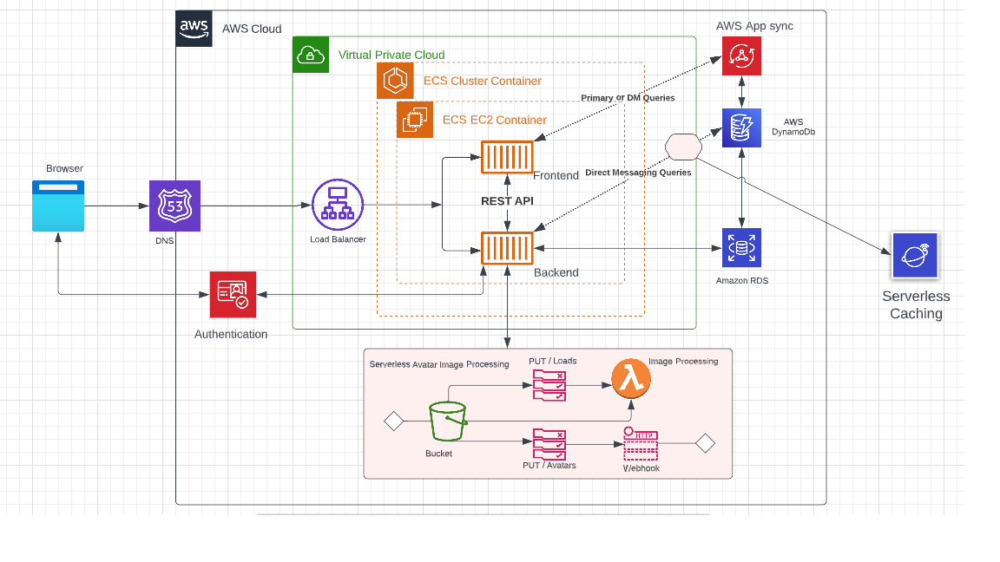

# Week 0 — Billing and Architecture
## Home Work Tasks
The following tasks were given as Home work after the week 0 class

### Recreate Conceptual Diagram in Lucid Charts or on a Napkin

### Recreate Logical Architectual Diagram in Lucid Charts
I followed the template and recreated a logical architectural diagram for our Cruddur app using Lucid Chart.
A screenshot is as seen below:

### Create a Billing Alarm

### Create a Budget

### Install AWS CLI
