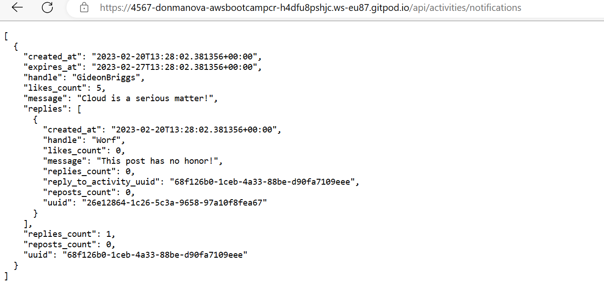
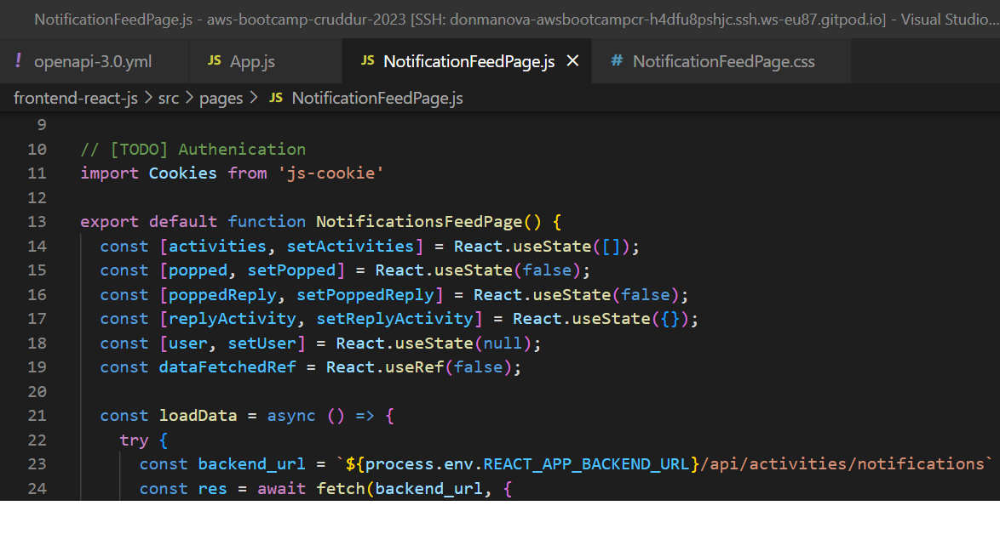
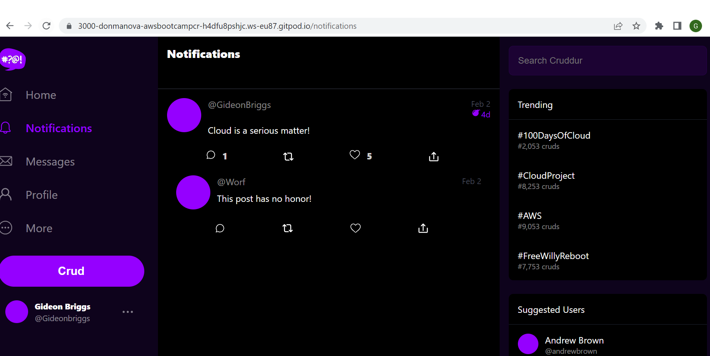
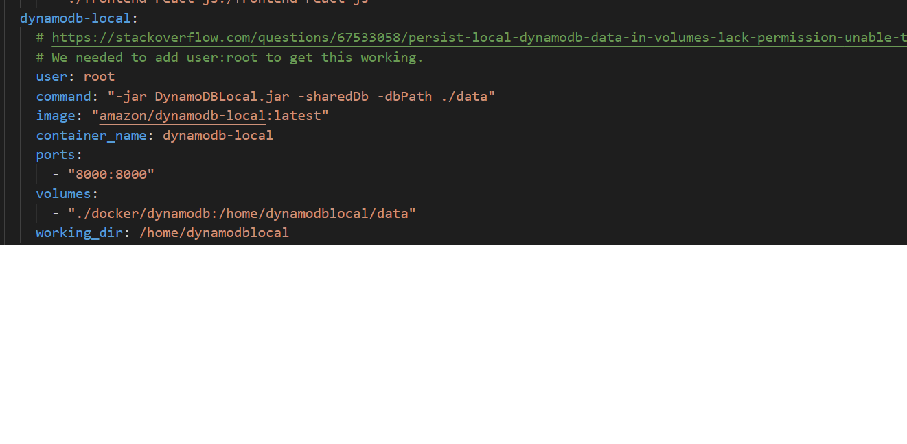
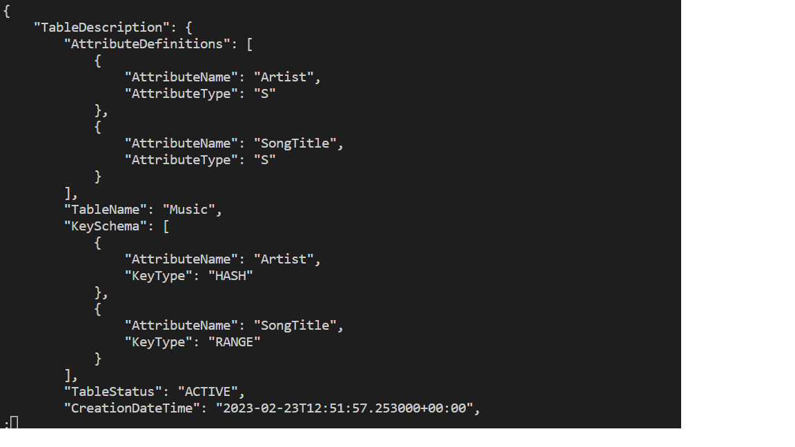
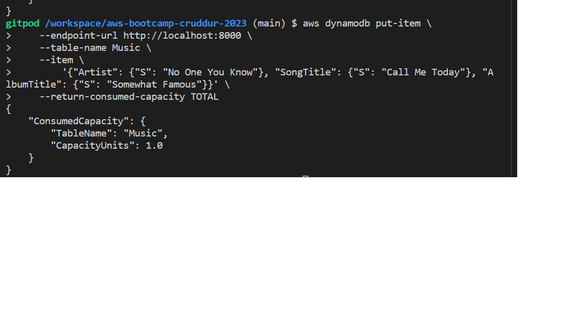
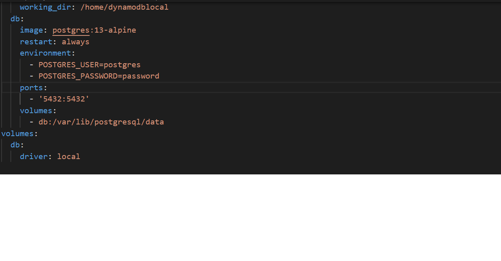
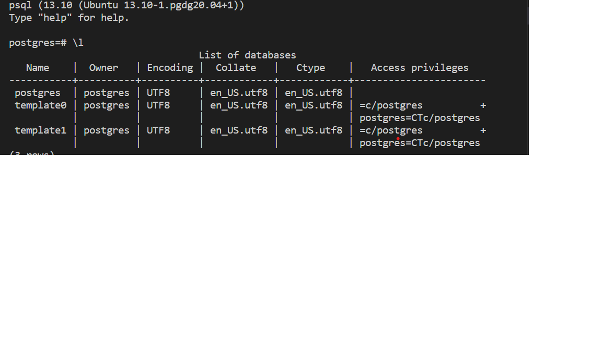

# Week 1 — App Containerization

## Home Work Tasks
The following tasks were given as Home work after the week 1 class

### Document the Notification Endpoint for the OpenAPI Document
I followed te video tutorial and was able to build Notification Endpoint using the OpenAPI Document provided.

### Write a Flask Backend Endpoint for Notifications
I modified the flask backend code provided to include a Notification functionality

### Write a React Page for Notifications
I created a new react and css page to handle Notifications

The final result of the notification page front end is shown below

### Run DynamoDB Local Container and ensure it works
I watched all videos related to this task and was able to successfully run a dynamodb local container.

I was also able to create a table in the dynamodb container

I created items for the table

I queried the database for list of tables

I scanned the table to retrieve items
[DynamoDb Table: Scanned items](assets/dynamodb-scan-table.png)

### Run Postgres Container and ensure it works
I successfully implemented and tested the postgres container

