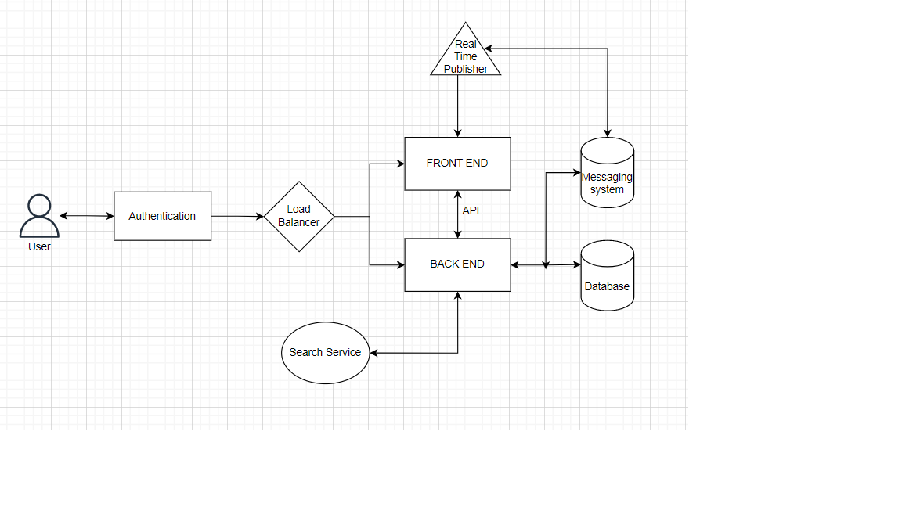

# Week 1 — App Containerization

## Home Work Tasks
The following tasks were given as Home work after the week 1 class

### Document the Notification Endpoint for the OpenAPI Document
I followed te video tutorial and was able to build Notification Endpoint using the OpenAPI Document provided.

### Write a Flask Backend Endpoint for Notifications
I modified the flask backend code provided to include a Notification

### Write a React Page for Notifications
I created a new react and css page to handle Notifications

### Run DynamoDB Local Container and ensure it works

### Run Postgres Container and ensure it works
