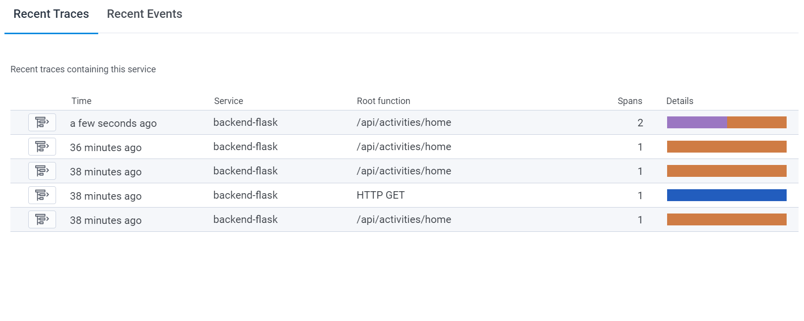
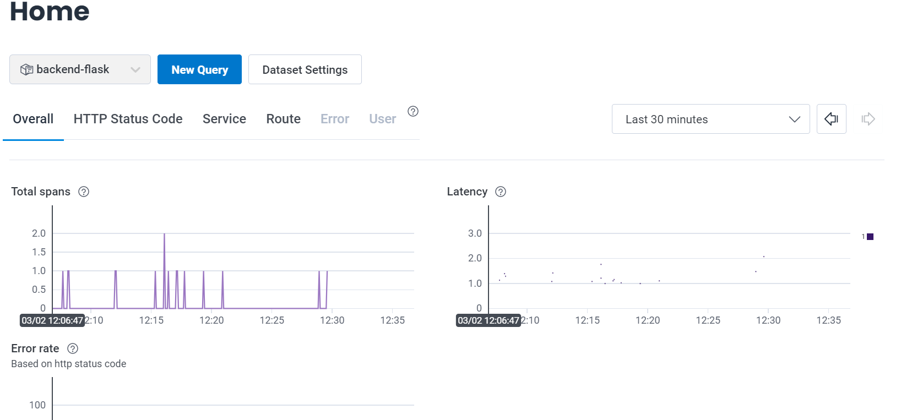
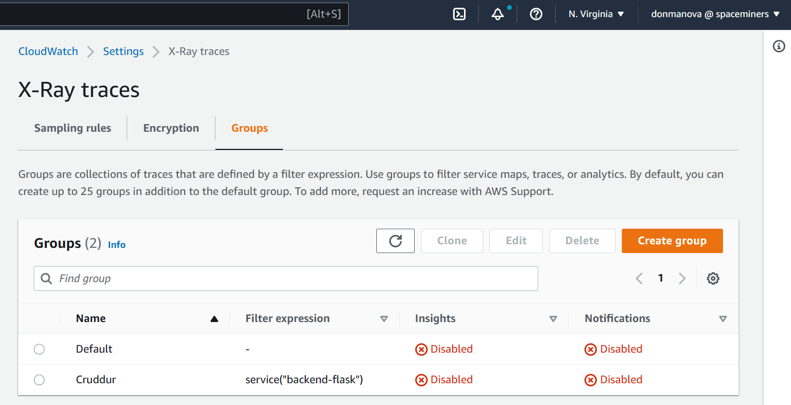
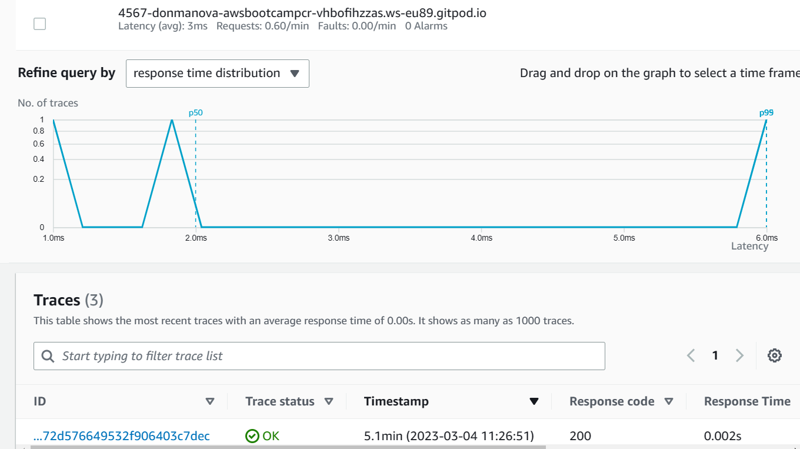
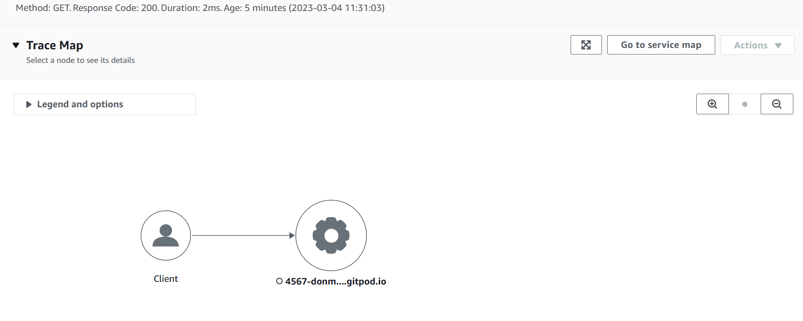
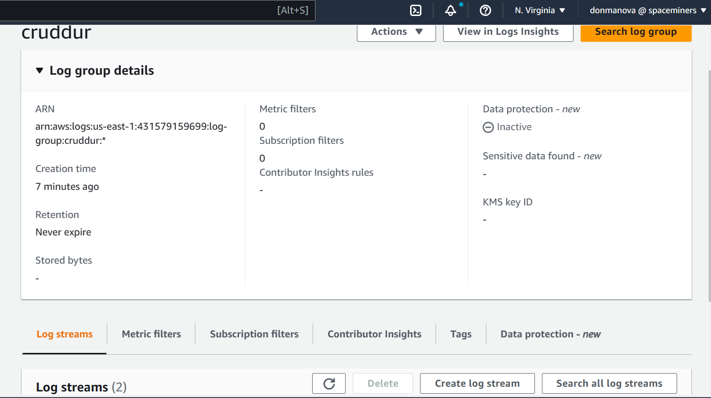
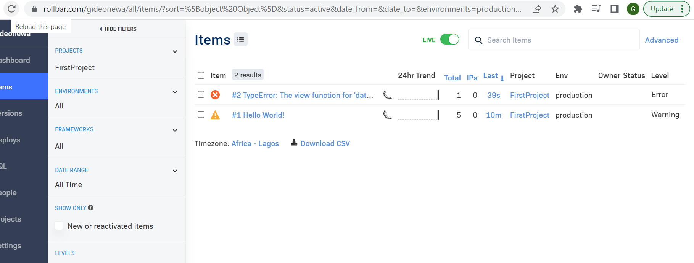

# Week 2 — Distributed Tracing
## Home Work Tasks
After watching all videos, the following tasks were done and completed

### Instrument Honeycomb with OTEL
I configured Honeycomb open Telemetry and was able to get Spans and Traces on my Honeycomb account.

### Instrument AWS X-Ray
I configured and instrumented AWS X-Ray on VSCODE using AWS CLI. 

I was also able to receive  X-ray traces from the cruddur app when i hit an API endpoint

### Configure custom logger to send to CloudWatch Logs
I configured a logger to send cloudwatch logs to my AWS account

### Integrate Rollbar and capture and error
I successfully integrated rollbar in the cruddur app and was able to receive error messages on my rollbar platform

