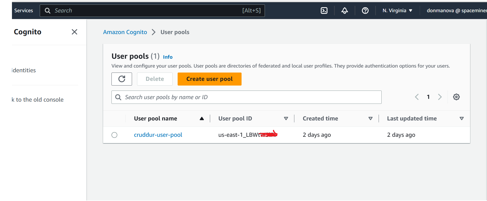
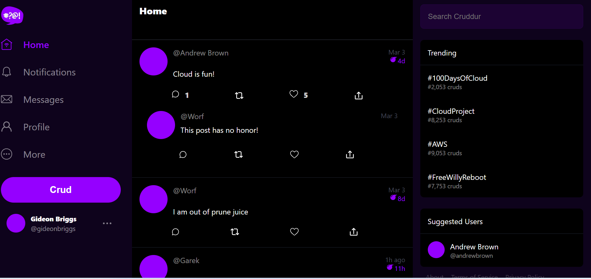
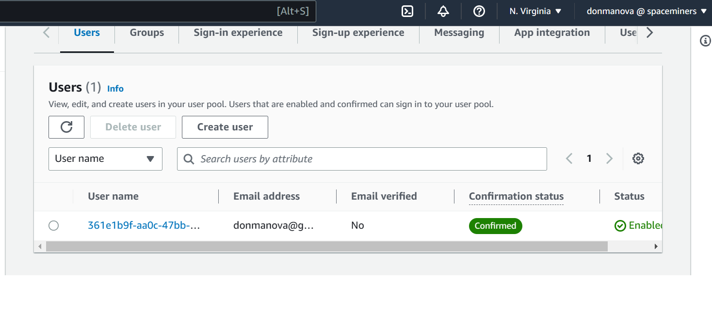
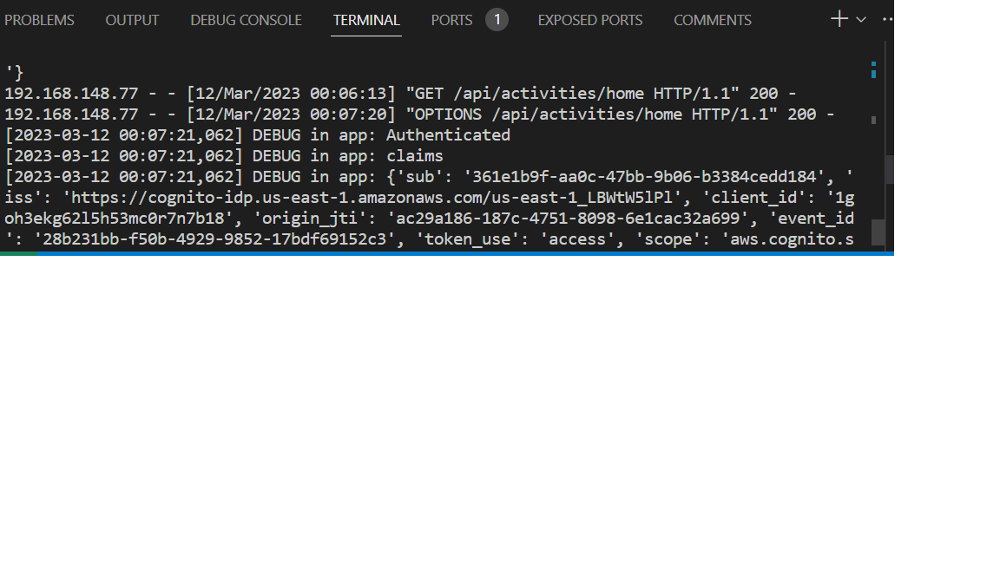

# Week 3 — Decentralized Authentication

## Homework Tasks
I watched all recommended videos for week 3 and implemented the following:

### Setup Cognito User Pool
I setup and configured Cognito userpool on AWS console

### Implement Custom Signin Page
I implemented the Sign in feature of our cruddur app using AWS cognito

### Implement Custom Signup Page
I implemented the Sign up feature of our cruddur app using AWS cognito

### Implement Custom Confirmation Page
I implemented a custom confirmation page to handle confirmation of sign up requests using AWS Cognito userpool

### Implement Custom Recovery Page
I implemented a recovery page to handle forgotten password issues using AWS Cognito userpool

### Implement different approaches to verifying JWTs
I implemented the use cognito JWT to verify claims on our cruddur application for the home activity API end point

