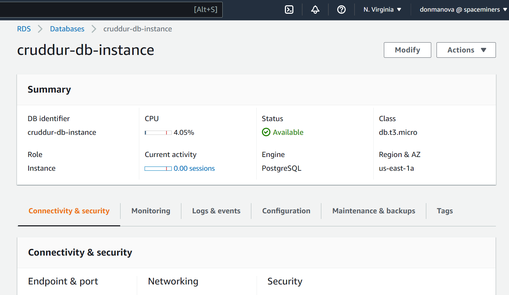
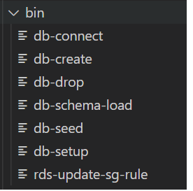
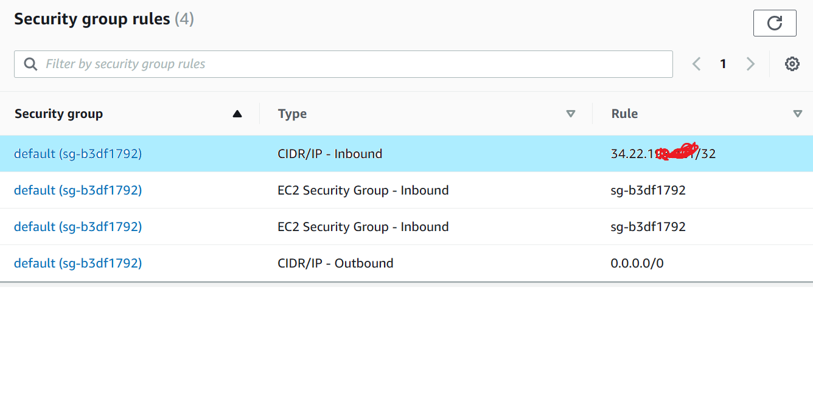
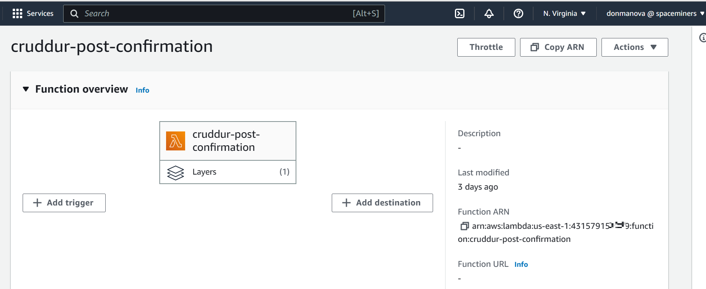
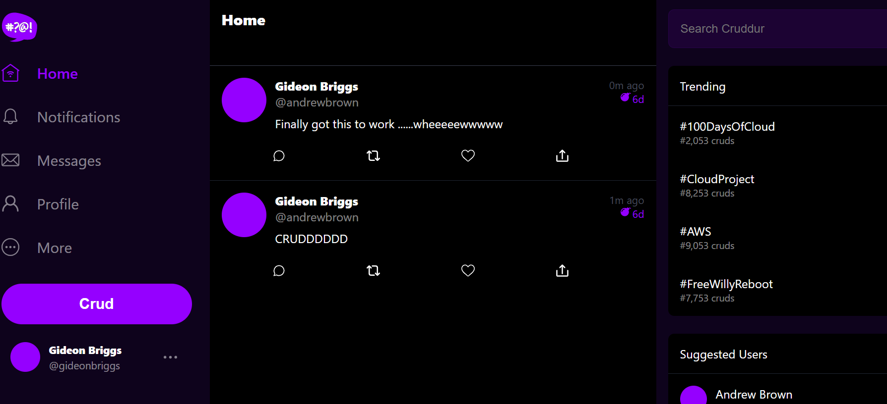

# Week 4 — Postgres and RDS
## Summary of Tasks Done
For the week in review, the following tasks were accomplished.

I created an RDS instance on AWS and connected my project to it. I created a schema for our Postgres DB.

I wrote some bash scripts to some basic database operations. I also wrote a bash script to automatically 
update gitpod IP address on my security group attached to the RDS instance. 

Wrote a lambda function to insert cognito user into the database.

Created new activities to insert CRUD into database and also show CRUD already in database

